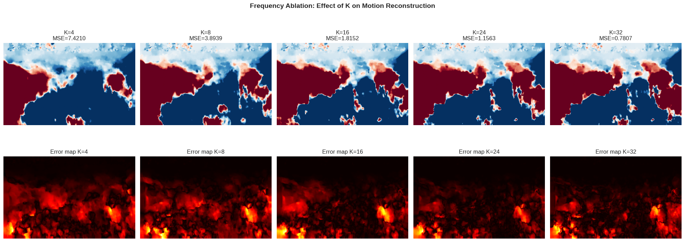
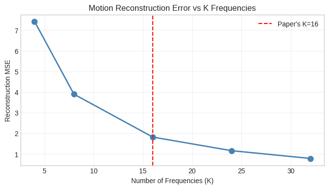

# Generative Image Dynamics — Google Colab Implementation

Unofficial implementation of [Generative Image Dynamics](https://generative-image-dynamics.github.io/) 
by Zhengqi Li et al., CVPR 2024.

## What this repo offers
- Fast, easy Google Colab implementation
- Updated dependencies for Python 3.12
- Fixed tensor shape issues not in original repo
- Frequency Ablation Analysis (our contribution)

## Download Models
[OneDrive Link](https://1drv.ms/u/s!AjGGQwItv34-bK738lmdo7wf2uk?e=cWvbXo)

## Frequency Ablation Results
We tested K = 4, 8, 16, 24, 32 frequencies across 3 videos:

## Finding
K=16 (paper's default) works well for gentle oscillatory motion 
but is insufficient for translational wave motion.
